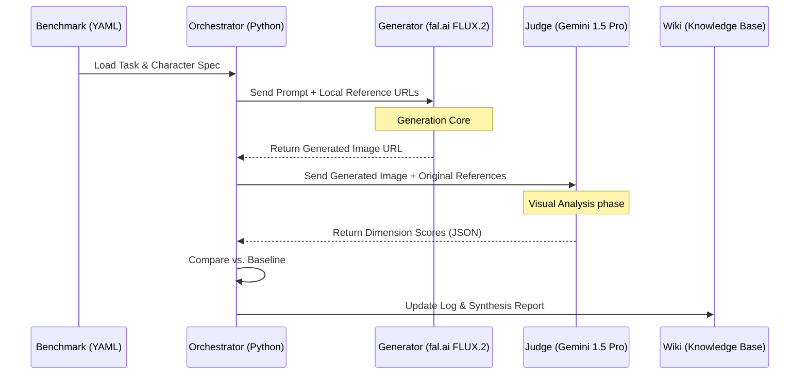

# Experiment Architecture: Character Consistency Lab

This document outlines the operational flow and rationale for the Lab's **Phase 3: Real Pixel Integration**.

## 1. High-Level Process Flow

The lab uses a multi-model feedback loop to execute and evaluate research hypotheses.

---

## 2. Component Rationale

### A. Generation (The "Muscle" - fal.ai)
*   **Engine**: FLUX.2 (Aesthetic Anchor)
*   **Infrastructure**: [fal.ai](https://fal.ai)
*   **Rationale**: fal.ai provides superior Multi-Reference Conditioning support. It allows the lab to apply specific weights (e.g., 1.5x for Style, 1.0x for Identity) across up to 4 reference images, enabling the "Reference Orchestration" research program.

### B. Evaluation (The "Judge" - Gemini 1.5 Pro)
*   **Engine**: Gemini 1.5 Pro (Logical Anchor)
*   **Infrastructure**: Google AI Studio / Vertex AI
*   **Rationale**: 
    1.  **Native Multimodality**: Capable of comparing multiple references against a generation in a single large context window.
    2.  **Reasoning-Based Scoring**: Unlike simple CLIP-based similarity, Gemini can reason about specific identity features (eye shape, hair texture, clothing detail).
    3.  **Standardization**: Returns structured JSON scores across 5 dimensions (Face, Hairstyle, Silhouette, Continuity, Art Style).

### C. Ingestion (The "Memory" - Research Wiki)
*   **Methodology**: Compounding Knowledge
*   **Rationale**: Ensuring every experiment—whether a WIN or a REJECTED hypothesis—is permanently logged. This creates a data-driven path toward perfect character persistence.

---

## 3. Benchmarking Framework

Experiments are evaluated against **5 Core Dimensions**:

1.  **Face Identity** (35%): Geometric and feature parity.
2.  **Hairstyle** (15%): Texture and flow consistency.
3.  **Silhouette** (20%): Body type and outline stability.
4.  **World Continuity** (20%): Environment and interaction logic.
5.  **Art Style Consistency** (10%): Aesthetic and lighting fidelity.

---

## 4. Current State
The lab is currently transitioning from **Phase 2 (Stubbed Simulation)** to **Phase 3 (Live Pixel Generation)**.
